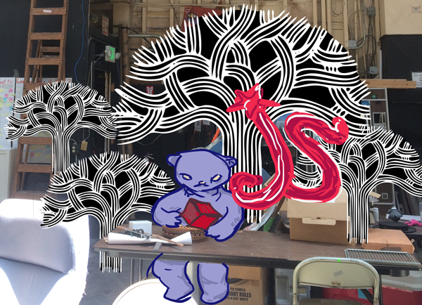

# Node.js Crash Course

Done late night at SudoRoom when I should have been resting or doing other
stuff.

Command line tutorial -> hacked the treehouse sample
to access the Open Oakland Public Service Request data off Socrata

This would be a good tutorial to get other people into node.js
and engaged. Since it's all command line it will be nice and
accessible, and then we can peruse the Oakland Open Data sets
	
	node app.js treehouse romyilano
	node app.js oakland_service
	
Getting a raw feed of the Oakland 2015-2016 budget from [OpenData Oakland](https://data.oaklandnet.com)

	node app.js oakland_budget
	

### Credits

_Reviewed node.js, filled in empty holes and stuff I had in my node knowledge
Courtesy tree house! thanks dudes and chaulkers great teacher_

## More Ideas

For tutorials and students we can practice on the Oakland Open Data sets.

* Most common reasons for food recalls [Socrata JSON Sample without keys](https://opendata.socrata.com/resource/9iuc-3wkn.json)  

* Overall Proficiency by ward for schools with part time or full time librarians
	**  [Socrata page](https://opendata.socrata.com/Education/Overall-Proficiency-by-Ward-for-Schools-w-Full-or-/xzgu-pmpy)  
	
and so on.

